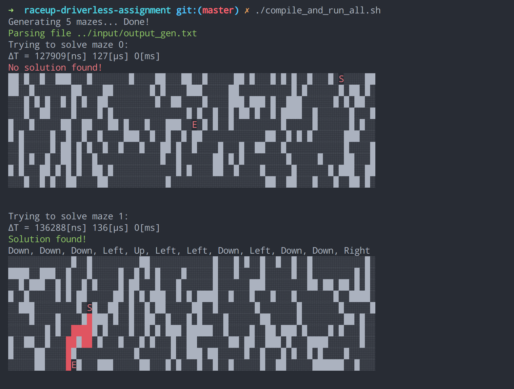

# RaceUP Driverless Assignment

## How to compile and run the project (Ubuntu)

Install build-essential (g++ is needed)

``` bash
sudo apt install build-essential
```

Just run:

``` bash
./compile_and_run_all.sh
```

Five mazes should be generated and written to: `input/output_gen.txt`, then `maze_solver` should get executed and solve the mazes that just got generated.

<p>
  
</p>

If the above doesn't work, the `main.cpp` file inside the folder `maze_solver` needs to be compiled (and also `maze_gen` if mazes need to be generated, the steps are the same):

``` bash
cd maze_solver
g++ main.cpp -o maze_solver
```

To run maze_solver:

``` bash
./maze_solver input.txt
```

To run maze_gen:

``` bash
./maze_gen 10 70 output.txt 5
```

This command generates 5 mazes with width of 70 characters and height of 10 and prints the output to the file `output.txt`.

## The algorithm

> **_NOTE:_** This algorithm finds \*\***A**\*\* path that gets to the end, it is by no means the shortest, but in some cases it gets pretty close.

First the starting and ending coordinates are found and then stored for later use.

An array of nodes keeps track of every movement inside the maze.

Each time a tile is visited, trace is kept inside the maze data structure (array of strings), by changing the `.` to a `V`, for VISITED.

The next best direction is chosen to step into by checking walls and visited tiles, that won't be explored again unless every direction is either visited or blocked.
In that case a step back gets taken.

A step in that direction gets taken.

Direction and coordinates get stored as a new node.

This gets executed until either the coordinates of the last node that gets added are:
1. The coordinates of the ending tile
2. The coordinates of the starting tile and each direction got already visited


